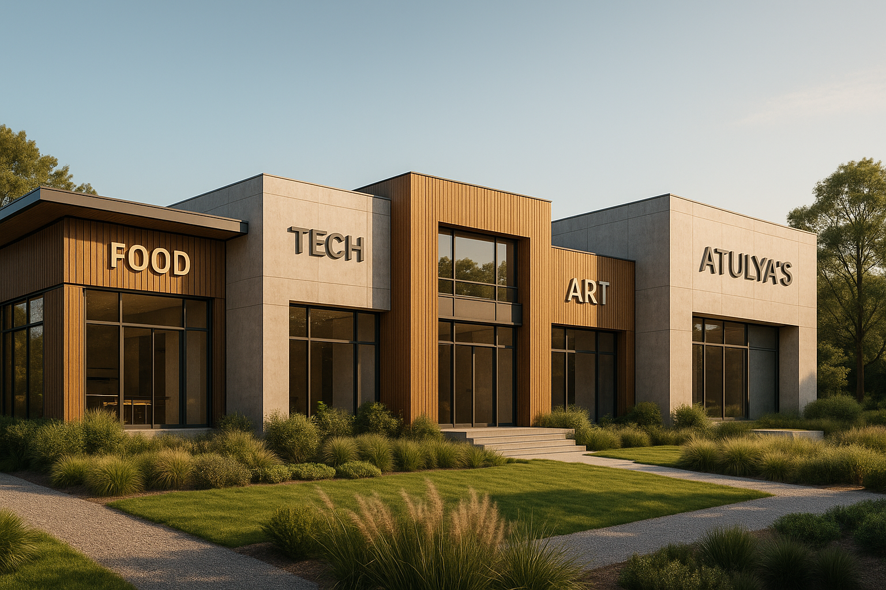

# 🚀 TheMicroStartup

> **"Build. Create. Sustain. Together."**

**TheMicroStartup** is an open-source initiative to empower youth to build sustainable, creative micro-economies blending **art, technology, and food**. It starts with a **physical retreat space (Atulya's)** — a creative playground — and scales through an open community that contributes ideas, tools, and frameworks for others to replicate or evolve.

---

## ✨ Vision

We envision a world where creators come together in self-sustainable spaces that combine artistry, technology, and culinary innovation. **TheMicroStartup** is not just a physical space—it's a movement, a framework, and a community that anyone can replicate.

**Tagline:** "Build. Create. Sustain. Together."  
**Vibe:** Playful Gen-Z energy meets grounded sustainability.



*Concept visualization of Atulya's — the self-sustainable retreat space for creators*

---

## 🎯 Core Objectives

| Goal | Description |
|------|-------------|
| 🏡 **Build Atulya's** | A self-sustainable retreat for creators — powered by art, tech, and food. |
| 🌐 **Open Source** | Create a directory for collaboration — open, structured, and easy to contribute. |
| 🧰 **Tools & Infrastructure** | Include plans for physical tools (servers, hardware lab, kitchen lab, etc). |
| 💡 **Ideation Flow** | Encourage members to share ideas, projects, or experiments. |
| 💸 **Economic Loop** | Design micro-economies (retreats, residencies, side hustles) targeting ₹3–4L/month. |
| 🤝 **Community Growth** | Invite-only community for creators in tech–food–art (free but vetted). |

---

## 🧭 Core Principles

- **Open Source, Not Free Ride:** Every member contributes value.
- **Self-sustainability First:** Financial + ecological + emotional balance.
- **Maker > Consumer:** Everyone builds something tangible or digital.
- **Fun is Serious:** The space encourages play, curiosity, and experimentation.

---

## 👥 Who Can Contribute?

| Type | Role |
|------|------|
| 🎨 **Artists** | Design, mural, creative experience curators |
| 🧑‍💻 **Techies** | Build hardware, software, automation tools |
| 🧑‍🍳 **Food Creators** | Culinary experimenters, local sourcing, fermentation, sustainability |
| 🌿 **Sustainability Enthusiasts** | Help design eco-friendly systems (energy, waste, compost) |
| 📈 **Business / Strategy** | Help create revenue loops, brand collabs, and pricing models |
| 🧑‍🤝‍🧑 **Community Builders** | Organize local meetups, retreats, and invite-only events |

---

## 📂 Repository Structure

```
TheMicroStartup/
├── 📘 README.md              # You are here
├── 📜 LICENSE.md             # Open-source license (Creative Commons BY-SA)
├── 🧭 CONTRIBUTING.md        # Contribution guidelines and templates
├── 🧱 PROJECTS/              # Active projects and experiments
├── 🧩 IDEAS/                 # Raw idea dumps, structured by tags
├── 💬 COMMUNITY/             # Community governance and guidelines
│   ├── governance/          # AI governance, manifesto
│   ├── platforms/           # EightEngine integration
│   ├── roles/               # Community roles
│   ├── policies/            # Code of conduct, invite system
│   └── meetings/            # Meeting notes
├── 📊 BUSINESS/              # Business models and strategies
│   ├── plans/               # Business plans
│   ├── revenue/             # Revenue models
│   ├── financial/           # Financial analysis
│   ├── membership/          # Membership models
│   ├── operations/         # Operations models
│   ├── market/              # Market analysis
│   ├── partnerships/        # Partnership models
│   └── metrics/             # Success metrics
├── 📸 VISUALS/               # Design assets and visuals
│   ├── designs/             # Design concepts (Atulya's, logos)
│   ├── diagrams/            # Architecture, flowcharts
│   ├── media/               # Videos, images, animations
│   └── campaigns/           # Marketing assets
├── 🧠 RESEARCH/              # Research and analysis
│   ├── market/              # Market research
│   ├── technology/           # Technology research
│   ├── sustainability/      # Sustainability research
│   ├── community/           # Community research
│   └── methodology/         # Research methodology
└── 🧾 DOCS/                  # Documentation
    ├── strategic/           # Strategic docs (PRD, roadmap)
    ├── technical/           # Technical docs (architecture, integration)
    ├── analysis/            # Analysis documents
    └── templates/           # Documentation templates
```

Explore each directory to find templates, active projects, and community resources.

---

## 🚀 Quick Start

### For Contributors

1. **Fork this repository** and clone it locally
2. **Read [CONTRIBUTING.md](CONTRIBUTING.md)** for guidelines
3. **Choose your contribution:**
   - 💡 Submit an idea → `IDEAS/` folder
   - 🧱 Start a project → `PROJECTS/` folder
   - 📖 Improve documentation → `DOCS/` folder
   - 🤝 Join the community → `COMMUNITY/` folder
4. **Create a branch** for your work
5. **Submit a Pull Request** and tag your domain (`#art`, `#tech`, `#food`, `#business`, etc.)

### For Community Members

- Join **EightEngine** — our main public community platform ([Learn More](COMMUNITY/eightengine.md))
- Check out active projects in `PROJECTS/`
- Review ideas in `IDEAS/` and vote/comment
- Attend virtual or in-person meetups

---

## 🗺️ Phase Plan

| Phase | Goal | Key Deliverables |
|-------|------|------------------|
| **Phase 1** | Build the digital base | Repo, README, structure, templates ✅ |
| **Phase 2** | Community onboarding | Invite creators, start first 10 idea files |
| **Phase 3** | Land + Infrastructure planning | Open-source sustainability + architecture plans |
| **Phase 4** | Prototype Atulya's | Minimal viable retreat setup |
| **Phase 5** | Financial model | Achieve ₹3–4L/month loop |
| **Phase 6** | Replicate | Share the model so others can make their own "MicroStartups" |

**Current Status:** 🟢 Phase 1 — Digital Foundation

---

## 🤝 Community Rules

1. **Invite-only, but open-source:** Anyone can contribute to code/docs, but only vetted creators can access the physical space.
2. **Zero hierarchy:** Use working groups and project leads, not managers.
3. **Transparency first:** All spending, plans, and decisions are open.
4. **Contribution > Title:** Every member documents their work publicly.
5. **Respect & Play:** No toxicity, pressure, or commercial greed — this is an ecosystem.

See [COMMUNITY/code-of-conduct.md](COMMUNITY/code-of-conduct.md) for detailed guidelines.

---

## 🛠️ Tech Stack

- **Repo host:** GitHub / Cursor
- **Docs:** Markdown + Mermaid for diagrams
- **Community Platform:** [EightEngine](COMMUNITY/eightengine.md) — Main public community (in development)
- **Design:** Figma / Excalidraw boards
- **Planning:** Notion (synced with repo readme sections)

---

## 📝 License

This project is licensed under [Creative Commons Attribution-ShareAlike 4.0 International](LICENSE.md) (CC BY-SA 4.0). See [LICENSE.md](LICENSE.md) for details.

---

## 🙏 Acknowledgments

Built with love by creators, for creators. Every contribution makes this ecosystem stronger.

---

## 📬 Get Involved

- 📧 Email: [anuragatulya.work@gmail.com]
- 🚀 **EightEngine:** [Main Public Community](in development)
- 🐦 Twitter: [coming soon]
- 📸 Instagram: [anurag_atulya]

---

**Ready to build something amazing?** [Start Contributing →](CONTRIBUTING.md)

